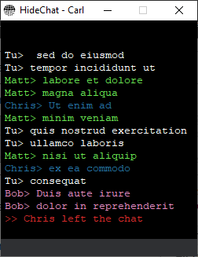
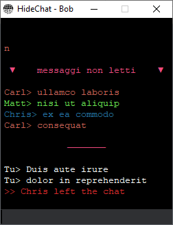

# HideChat

- the socket client/server application written entirely in python, allows you to connect to the server by entering the ip address, and after entering the nickname it is possible to chat with users connected to the same server
- the messages are not saved and neither are the users who log in
- it is possible to send files of any type in broadcast or by choosing a specific user
- you can download the instructions from the application

